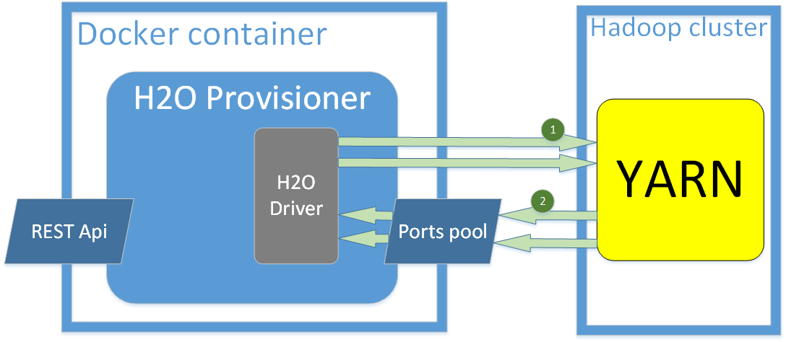

[](https://www.versioneye.com/user/projects/572367a2ba37ce004309f2c3)

# h2o-provisioner
H2O Provisioner is an application which can spawn H2O instances on YARN.
It's prepared to be executed inside Docker container to make it easier to run it in the cloud environemnt.

### Overview
The default use case of H2O Proviosioner is to spawn H2O instances on demand. It can be invoked via REST Api. After REST call, application uses H2O Driver to instantiate H2O on YARN. H2O Driver is a tool provided by H2O Team to run H2O on Hadoop cluster. It needs to open a port for a feedback communication from YARN. That's why we've implemented Ports pool to manage ports in case of spawning many H2O instances at the same time.




## REST Interface
### Provisioning H2O instance

Path: ```/rest/instances/{instanceId}/create```

Allowed method: POST

Required params:
* instanceId
  * Path variable
  * Unique identifier of h2o instance
* nodesCount
  * Request parameter 
  * Number of H2O nodes to be spawned.
* memory
  * Request parameter 
  * Amount of memory for a single H2O node. E.g. 256m, 1g.
* YARN configuration
  * Request body
  * Format:
  ```json
    {
      "property1.name":"property1.value",
      "property2.name":"property2.value",
      ...
    }
  ```
  
Response format:
  ```json
  {
    "hostname": "10.10.10.117",
    "password": "MGImIG4QBlNg",
    "port": "54323",
    "username": "b20qy4sm"
  }
  ```
### Deprovisioning H2O instance
Path: ```/rest/instances/{instanceId}/delete```

Allowed method: POST

Required params:
* instanceId
  * Path variable
  * Unique identifier of running h2o instance (provided with provisioning request)
* YARN configuration
  * Request body
  * Format:
  ```json
    {
      "property1.name":"property1.value",
      "property2.name":"property2.value",
      ...
    }
  ```
  
Response format:
  ```text
  <killed YARN job id>
  ```

## Run

### Build project
To build application you can use maven:

```mvn clean package```

It will generate two jar files in target directory:

```
h2o-provisioner-<version>.jar
h2o-provisioner-<version>-api.jar
```

The first one is provisioner application. The second one is a client library. It is recommended to attach it to the application which will call h2o-provisioner via REST Api.

### Build Docker image
You will need in your working directory:
* Dockerfile (in this repo src/main/docker)
* krb5.conf template (in this repo src/main/docker)
* h2o-provisioner jar (built by "mvn clean package" in root dir of this repo)
* h2odriver jar (recommended version 3.0.1.7)
  * can be downloaded: ```wget http://h2o-release.s3.amazonaws.com/h2o/rel-simons/7/h2o-3.0.1.7-cdh5.4.2.zip```
* hadoop-2.6.0.tar.gz
  * can be downloaded: ```wget http://archive.apache.org/dist/hadoop/core/hadoop-2.6.0/hadoop-2.6.0.tar.gz```

To build the image execute:

```docker build -t tap/h2o-provisioner .```

### Run application
Replace "PLACEHOLDER" values below with correct values.
```
docker run \
-p 8080:8080 \
-p 54310-54319:54310-54319 \
-e DRIVER_PORT_LOWER=54310 \
-e DRIVER_PORT_UPPER=54319 \
-e DRIVER_IP=PLACEHOLDER \
-e KRB_KDC=PLACEHOLDER \
-e KRB_REALM=PLACEHOLDER \
-e KRB_USER=PLACEHOLDER \
-e KRB_PASSWORD=PLACEHOLDER \
tap/h2o-provisioner
```

Parameters:
* 8080:8080 - it means that port 8080 from container will be exposed outside as a port 8080.
* 54310-54319:54310-54319 - it means that 10 ports from range 54310:54319 will be exposed outside container as the same ports range.
* DRIVER_PORT_LOWER=54310, DRIVER_PORT_UPPER=54319 - it's an information for h2o-provisioner, that ports range 54310:54319 is available to use and will be visible outside.
* DRIVER_IP=PLACEHOLDER - here you should set IP Address of docker host. H2o-provisioner will use it to provide callback url for YARN.
* KRB_KDC - here you should set Kerberos KDC host.
* KRB_REALM - here you should set Kerberos REALM name.
* KRB_USER - here you should set name of Kerberos user.
* KRB_PASSWORD - here you should set password of Kerberos user.

### Call h2o-provisioner from curl:
```
curl -i "1ocalhost:8080/rest/instances/instanceName/create?memory=512m&nodesCount=1" \
-X POST -H "Content-Type: application/json" \
-d '{"<name1>": "<value1>", "<name2>": "<value2>", ... "<nameN>": "<valueN>"}'
```
where request body is yarn-conf in JSON format.
Above instruction will spawn 1-node h2o instance with 512m memory and name "instanceName"

```
curl -i "1ocalhost:8080/rest/instances/instanceName/delete" \
-X POST -H "Content-Type: application/json" \
-d '{"<name1>": "<value1>", "<name2>": "<value2>", ... "<nameN>": "<valueN>"}'
```
where request body is yarn-conf in JSON format.
Above instruction will kill YARN job H2O instance "instanceName" was spawn on.

### Call h2o-provisioner from Java application:
Add dependency to client library into your maven pom.xml file:
```
<dependency>
  <groupId>org.trustedanalytics</groupId>
  <artifactId>h2o-provisioner</artifactId>
  <version>0.5.8</version>
  <classifier>api</classifier>
</dependency>
```

#### Provisioning H2O instance
Using below class you can call h2o-provisioner started on localhost. You should invoke ```test()``` method with ```Map<String, String>``` object containing YARN configuration.
```java
import org.springframework.http.ResponseEntity;
import org.springframework.web.client.RestTemplate;
import org.trustedanalytics.servicebroker.h2oprovisioner.rest.api.H2oCredentials;
import org.trustedanalytics.servicebroker.h2oprovisioner.rest.api.H2oProvisionerRestApi;
import org.trustedanalytics.servicebroker.h2oprovisioner.rest.api.H2oProvisionerRestClient;

import java.util.Map;

public class H2oProvisionerCall {

    public void test(Map<String, String> yarnConfig) {

        H2oProvisionerRestApi h2oRest =
            new H2oProvisionerRestClient("localhost:8080", new RestTemplate());

        ResponseEntity<H2oCredentials> response = h2oRest.createH2oInstance(
            "instance-ID", "1", "512m", yarnConfig);

        System.out.println("HTTP response status: " + response.getStatusCode());
        System.out.println("H2O Credentials: " + response.getBody());
    }
}
```
#### Deprovisioning H2O instance
Using below class you can call h2o-provisioner started on localhost. You should invoke ```test()``` method with ```Map<String, String>``` object containing YARN configuration.
```java
import org.springframework.http.ResponseEntity;
import org.springframework.web.client.RestTemplate;
import org.trustedanalytics.servicebroker.h2oprovisioner.rest.api.H2oProvisionerRestApi;
import org.trustedanalytics.servicebroker.h2oprovisioner.rest.api.H2oProvisionerRestClient;

import java.util.Map;

public class H2oProvisionerCall {

    public void test(Map<String, String> yarnConfig) {

        H2oProvisionerRestApi h2oRest =
            new H2oProvisionerRestClient("localhost:8080", new RestTemplate());

        ResponseEntity<String> response = h2oRest.deleteH2oInstance("instance-ID", yarnConfig);

        System.out.println("HTTP response status: " + response.getStatusCode());
        System.out.println("Killed H2O YARN job id: " + response.getBody());
    }
}
```


